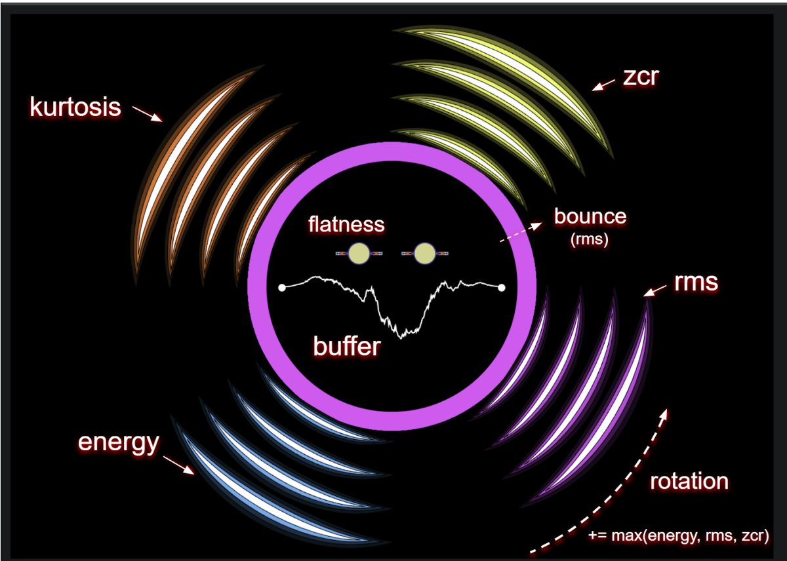
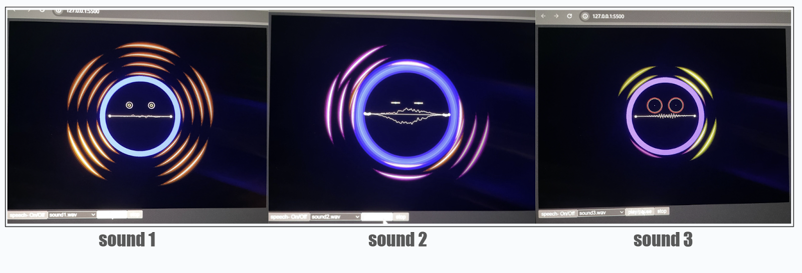

# Meyda Audio Visualization Demo

This project is a browser-based audio visualization built with [p5.js](https://p5js.org) and [Meyda](https://meyda.js.org/). It extracts audio features in real time and renders interactive graphics that respond to the music. Optional speech recognition lets you control playback and visuals with your voice.

## Features
- Plays bundled demo sounds and visualizes them using p5.js
- Real-time extraction of features such as RMS, spectral centroid, and zero-crossing rate via Meyda
- Speech commands through `p5.speech` for changing colors, shapes, and playback

## Installation
1. Clone this repository.
2. Ensure a local web server is available (e.g., Node.js or Python).
3. From the repository root, start a server:
   - Node.js: `npx http-server .`
   - Python: `python -m http.server`
4. Open `index.html` in your browser at the server's address (e.g., `http://localhost:8080`).

## Usage
- Select a track from the dropdown menu and use the buttons to play, pause, or stop.
- Watch the visualization react to audio features.
- Enable speech controls with the **speech On/Off** button.

## Screenshots

